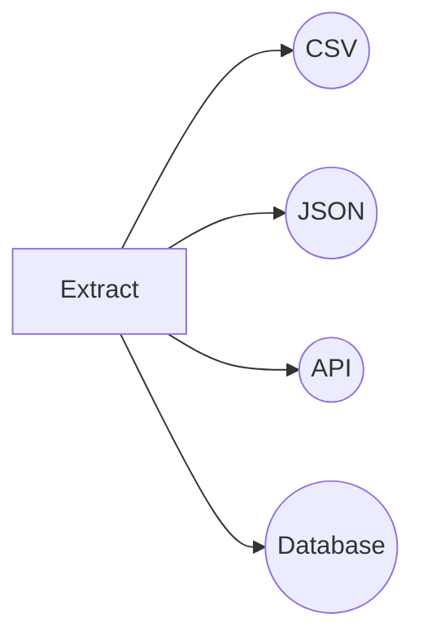
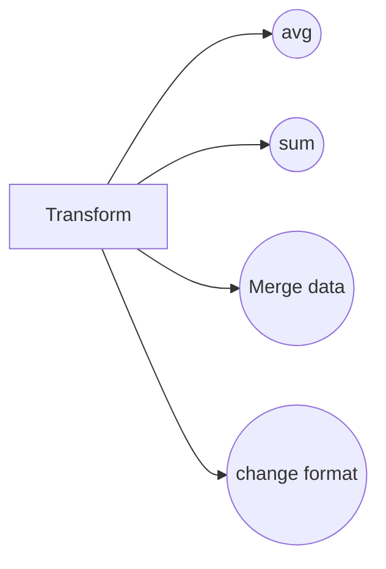
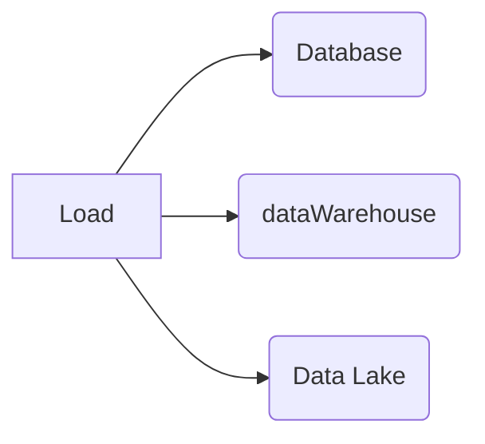
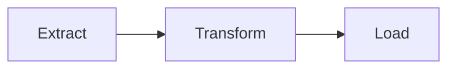

# road-to-data-engineer

###  Extract

```mermaid
graph LR
A[Extract] --> B((CSV))
A[Extract] --> C((JSON))
A[Extract] --> D((API ))
A[Extract] --> E((Database))
```
###  Transform

```mermaid
graph LR
A[Transform] --> B((avg))
A[Transform] --> C((sum ))
A[Transform] --> D((Merge data))
A[Transform] --> E((change format))
```
### Load

```mermaid
graph LR
A[Load] --> B(Database)
A[Load] --> C(dataWarehouse)
A[Load] --> D(Data Lake)
```
###  ETL

```mermaid
graph LR
A[Extract] --> B[Transform]
B --> C[Load]
```

###  ELT

```mermaid
graph LR
A[Extract] --> B[Transform]
B --> C[Load]
```
